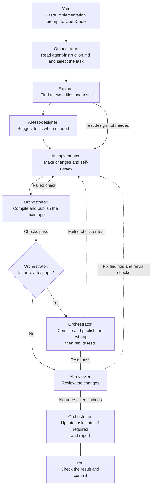
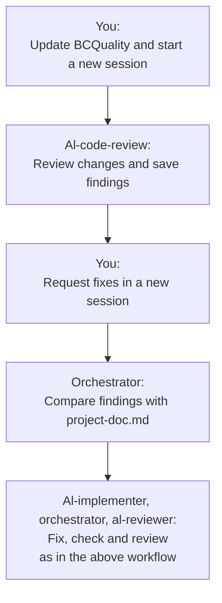

+++
date = '2026-01-09T21:18:48+01:00'
title = 'AI'
weight = 30
mermaidInitialize = '{ "htmlLabels": false, "flowchart": { "htmlLabels": false } }'
+++

I use OpenCode, describe the project, [give the agents a task]({}), then check the changes before committing.

1. Project documentation is described in [project-doc.md]({})
2. Prompt is saved in [agent-instruction.md]({})
3. Agents describe the workflow
4. Skills explain how to do the technical work

## What you need

- [OpenCode](https://opencode.ai/) — the tool to run the agents.
- [ai-config](https://github.com/addmecode/ai-config) — shared agents, AL skills, scripts and common instructions.
- [project-doc.md]({}) — the project description, requirements and task plan.
- [agent-instruction.md]({}) — the project prompt: task selection, checks, Git rules and final report.
- [AL Language extension](https://marketplace.visualstudio.com/items?itemName=ms-dynamics-smb.al) — AL tooling used by the scripts.
- [BCQuality](https://github.com/microsoft/BCQuality) — the Microsoft's al-code-review skill for broader reviews.


## Files

`->` means a symbolic link. `App/` is an example folder name.

```text
BC project/
├── Docs/
│   ├── project-doc.md
│   ├── agent-instruction.md
│   └── bcquality-cr-YYYYMMDD-HHmm.md
├── .opencode/ -> ai-config/linked/agents/.opencode/
├── App/                   # app.json, launch.json and AL code
├── Test/                  # Test app and launch.json
└── .AL-Go/settings.json

ai-config/
├── linked/
│   ├── agents/.opencode/  # Agent definitions and opencode.jsonc
│   ├── skills/            # AL instructions and scripts
│   └── memory/MEMORY.md   # Common instructions
└── tools/
    ├── Sync-AiConfig.ps1
    └── Link-OpenCodeProject.ps1
```


## Workflow

### Implement a task

Use the [implementation prompt]({}), or [describe a specific change]({}).

For AL changes, the workflow compiles and publishes the main app. If a test app exists, it also compiles and publishes that app, then runs the relevant tests.



In my project, each run handles one task and marks it `DONE` after successful checks and review. These rules are set in the project prompt. Other projects can use different rules.

### Review with BCQuality

Use [Create a BCQuality report]({}), then [Fix review findings]({}).



## More details

- [Implementation Workflow]({}) — project documents and daily use.
- [Agent Orchestration]({}) — who does what.
- [Shared AI Configuration]({}) — setup, skills and scripts.
- [Verification and Code Review]({}) — tests, CI and BCQuality.
- [Prompts]({}) — ready-to-use commands.
